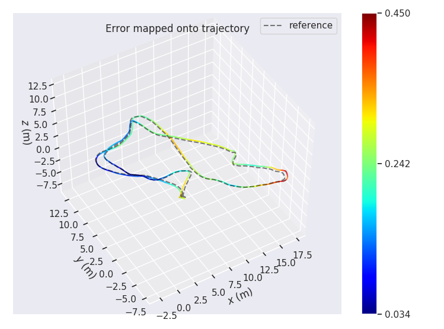

# Vins Course
[](README.md)

**Authors**: He Yijia, Gao Xiang, Cui huakun, Zhao Song

**Introduction**：
This project is used for an online course about visual inertial odometry on [shenlanxueyuan](http://www.shenlanxueyuan.com). She is based on the VINS-Mono framework but does not rely on ROS, Ceres, G2o. This code is very basic and aims to demonstrate Eigen-based back-end LM algorithms, sliding window algorithms, robust kernel functions, etc. This code supports for Ubuntu or Mac OS.

## Prerequisites：

1. pangolin: <https://github.com/stevenlovegrove/Pangolin>

2. opencv

3. Eigen

4. Ceres. Uhhhhh, vins-mono use ceres to do sfm bundle adjustment. So we need ceres. 

### Build

```c++
mkdir vins_course
cd vins_course
git clone https://github.com/HeYijia/VINS-Course
mkdir build 
cd build
cmake ..
make -j4
```

### Run
#### 1. CurveFitting Example to Verify Our Back-End Solver.
```c++
cd build
../bin/testCurveFitting 
```

#### 2. VINs-Mono on Euroc Dataset
```c++
cd build
../bin/run_euroc /home/dataset/EuRoC/MH-05/mav0/ ../config/
```


#### 3. VINs-Mono on Simulation Dataset (project homework)

you can use this code to generate vio data.

```c++
https://github.com/HeYijia/vio_data_simulation
```
#### 4. Validation Results
[evo package](https://github.com/MichaelGrupp/evo)
```c++
evo_ape euroc euroc_mh05_groundtruth.csv pose_output.txt -a -p
```



### Licence

The source code is released under GPLv3 license.

We are still working on improving the code reliability. For any technical issues, please contact Yijia He <heyijia_2013@163.com> , Xiang Gao <https://github.com/gaoxiang12> or Huakun Cui<https://github.com/StevenCui>.

For commercial inquiries, please contact Song Zhao <zhaosong@shenlanxueyuan.com>

## Acknowledgements

We use [VINS-Mono](https://github.com/HKUST-Aerial-Robotics/VINS-Mono) as our base line code. Thanks Dr. Qin Tong, Prof. Shen etc very much.
